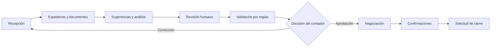

# CrediTrade

CrediTrade es un MVP web para registrar, validar, negociar y confirmar notas de crédito tributarias en Ecuador. Centraliza cada caso en un expediente único y distribuye el trabajo entre recepción, validación y negociación.

La inteligencia artificial apoya al operador con sugerencias, evidencia, explicaciones y borradores. No aprueba expedientes ni ejecuta liquidaciones, transferencias o endosos.

**Aplicación:** [creditrade.vercel.app](https://creditrade.vercel.app/)

## Funciones principales

- Registrar clientes, notas de crédito y documentos de respaldo.
- Consultar antecedentes y detectar posibles duplicados.
- Generar y revisar sugerencias de Gemini.
- Recuperar evidencia mediante RAG y búsqueda vectorial.
- Coordinar análisis especializados con LangGraph y checkpoints humanos.
- Validar existencia, saldo, estado, bloqueos, faltantes y riesgos.
- Preparar negociaciones dentro de límites confirmados.
- Continuar con confirmaciones aunque no se genere un PDF.
- Conservar trazabilidad del operador, la fecha y la decisión.

## Flujo de trabajo



### Operador 1: recepción

Busca o registra al cliente, crea el expediente, agrega documentos y revisa cada sugerencia antes de aplicarla.

### Operador 2: validación

Ejecuta reglas deterministas, revisa inconsistencias y decide si el caso vuelve a corrección o pasa a negociación. La explicación de Gemini es informativa.

### Operador 3: negociación

Selecciona al comprador, define valores y fechas, prepara el borrador y gestiona las confirmaciones necesarias para solicitar el cierre.

## LangGraph, Gemini y RAG

Cada componente cumple una función distinta:

- **LangGraph** coordina las etapas y agentes especializados del análisis.
- **Gemini** genera sugerencias, explicaciones y texto estructurado.
- **RAG** recupera fragmentos de documentos y antecedentes relevantes mediante embeddings.
- **Las reglas de negocio** producen validaciones deterministas aunque Gemini no esté disponible.
- **El operador** conserva siempre la decisión final.

El flujo agentic se detiene en checkpoints humanos. Una recomendación nunca modifica automáticamente los datos ni autoriza una operación.

## Arquitectura

| Capa | Tecnología y responsabilidad |
|---|---|
| Interfaz | Django Templates, HTML, CSS y JavaScript |
| Aplicación | Django 5 y control de acceso por roles |
| Orquestación | LangGraph y agentes especializados |
| Reglas | Validaciones deterministas del expediente |
| IA | Google Gemini con Pydantic, reintentos y control de cuota |
| RAG | Embeddings de Gemini y búsqueda semántica con pgvector |
| Datos | PostgreSQL en Neon con extensión vector |
| Reportes | ReportLab |
| Despliegue | Vercel conectado a GitHub |

```text
accounts/       usuarios, autenticación y roles
credit_notes/   dominio, reglas, agentes, RAG, IA, reportes y vistas
creditrade/     configuración central de Django
templates/      interfaz renderizada en el servidor
static/         estilos, imágenes y JavaScript
```

La aplicación usa `DATABASE_URL` pooled para el tráfico normal y `DATABASE_URL_UNPOOLED` para las migraciones.

## Instalación local

### Requisitos

- Python 3.12 o superior.
- Git.
- PostgreSQL, preferiblemente Neon.
- Extensión `vector` de PostgreSQL.
- API key de Gemini para las funciones de IA.

### 1. Preparar el proyecto

```powershell
git clone https://github.com/Jareth20/CrediTrade.git
cd CrediTrade
py -m venv venv
.\venv\Scripts\Activate.ps1
python -m pip install -r requirements.txt
```

### 2. Crear la configuración privada

Crea un archivo `.env` junto a `manage.py`. No copies credenciales al README, a archivos de ejemplo, capturas o Git.

Variables mínimas:

```dotenv
DJANGO_SECRET_KEY=<clave-privada>
DJANGO_DEBUG=True
DATABASE_URL=<conexion-postgresql-pooled>
DATABASE_URL_UNPOOLED=<conexion-postgresql-directa>
DJANGO_USE_UNPOOLED=False
GEMINI_API_KEY=<clave-privada>
GEMINI_MODEL=<modelo-disponible-para-tu-proyecto>
GEMINI_EMBEDDING_MODEL=gemini-embedding-001
PUBLIC_BASE_URL=http://127.0.0.1:8000
```

Variables opcionales frecuentes:

```dotenv
DJANGO_ALLOWED_HOSTS=localhost,127.0.0.1
CSRF_TRUSTED_ORIGINS=http://localhost:8000,http://127.0.0.1:8000
GEMINI_TIMEOUT_MS=60000
GEMINI_MAX_RETRIES=2
GEMINI_QUOTA_COOLDOWN_SECONDS=900
GEMINI_CACHE_SECONDS=86400
RAG_EMBEDDING_DIMENSIONS=768
RAG_TOP_K=4
DB_CONN_MAX_AGE=60
DEMO_LOGIN_PREFILL=True
DEMO_ADMIN_PASSWORD=<clave-local>
DEMO_OPERATOR_PASSWORD=<clave-local>
```

### 3. Preparar PostgreSQL y aplicar migraciones

En Neon, comprueba la extensión vector:

```sql
CREATE EXTENSION IF NOT EXISTS vector;
```

Usa la conexión directa únicamente durante las migraciones:

```powershell
$env:DJANGO_USE_UNPOOLED="True"
.\venv\Scripts\python.exe manage.py migrate
.\venv\Scripts\python.exe manage.py seed_demo
$env:DJANGO_USE_UNPOOLED="False"
```

`seed_demo` crea usuarios demostrativos. Define contraseñas propias con `DEMO_ADMIN_PASSWORD` y `DEMO_OPERATOR_PASSWORD`; no uses valores demostrativos en producción.

### 4. Iniciar la aplicación

```powershell
.\venv\Scripts\python.exe manage.py runserver
```

Abre [http://127.0.0.1:8000/](http://127.0.0.1:8000/).

## Verificación y pruebas

Comprobar Django y PostgreSQL:

```powershell
.\venv\Scripts\python.exe manage.py check
.\venv\Scripts\python.exe manage.py verificar_integraciones
```

La prueba de Gemini realiza una solicitud real y consume cuota:

```powershell
.\venv\Scripts\python.exe manage.py verificar_integraciones --gemini
```

Ejecutar las pruebas aisladas con SQLite:

```powershell
$env:DATABASE_URL="sqlite:///test.sqlite3"
$env:DJANGO_ALLOW_NON_POSTGRES_FOR_TESTS="True"
$env:DJANGO_SECRET_KEY="clave-solo-para-pruebas"
.\venv\Scripts\python.exe manage.py test
```

## Despliegue en Vercel

1. Importa el repositorio desde GitHub.
2. Usa como raíz la carpeta que contiene `manage.py`.
3. Configura los secretos en **Project → Settings → Environment Variables**.
4. Usa `DATABASE_URL` pooled y `DJANGO_USE_UNPOOLED=False` en Vercel.
5. Ejecuta las migraciones desde una máquina controlada con la URL directa.
6. No ejecutes migraciones automáticamente en cada build.
7. Despliega y consulta los Function Logs si una integración falla.

Configuración base de producción:

```dotenv
DJANGO_DEBUG=False
DJANGO_ALLOWED_HOSTS=.vercel.app
CSRF_TRUSTED_ORIGINS=https://*.vercel.app
DJANGO_USE_UNPOOLED=False
PUBLIC_BASE_URL=https://<proyecto>.vercel.app
SECURE_SSL_REDIRECT=True
SECURE_HSTS_SECONDS=3600
```

También debes configurar privadamente `DJANGO_SECRET_KEY`, las dos URL de base de datos, `GEMINI_API_KEY` y los modelos de Gemini.

## Seguridad

- `.env`, `.env.example` y sus variantes están ignorados.
- También se ignoran llaves, credenciales JSON, volcados y logs.
- No uses `git add -f` para publicar un archivo ignorado.
- No publiques capturas o reportes con datos reales.
- Rota cualquier credencial expuesta en un chat, log o commit.
- Cambia las contraseñas demostrativas antes de publicar el sistema.
- Las sugerencias de IA siempre requieren revisión humana.

El `.gitignore` evita inclusiones nuevas, pero no elimina secretos del historial. Si una credencial fue versionada, debes rotarla y limpiar el historial por separado.

## Limitaciones del MVP

- Las fuentes SRI y DECEVALE son simuladas o cargadas manualmente.
- No se ejecutan liquidaciones, transferencias, endosos ni firmas electrónicas.
- Los archivos reales requieren almacenamiento externo como Vercel Blob o S3.
- Gemini puede rechazar temporalmente solicitudes al alcanzar los límites de cuota.
- Para alto volumen se requieren colas, tareas en segundo plano y monitoreo.

## Autores

- Cristina Villacís — Ingeniería en Ciencias de la Computación.
- Jareth Rojas — Ingeniería en Ciencia de Datos e IA.
- Alejandro Verdesoto — Ingeniería en Ciencia de Datos e IA.

Proyecto desarrollado para el Track 4 del Hackathon de Agentic Scale.
