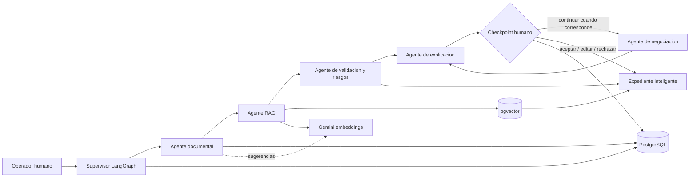

# Arquitectura agentica de CrediTrade

## Diagnostico y evolucion

La arquitectura anterior era un monolito Django bien delimitado con reglas de dominio,
Gemini para sugerencias/reportes y trazabilidad de acciones. La asistencia se ejecutaba
como funciones independientes: no existian grafo, estado compartido, memoria persistente,
checkpoints reanudables ni recuperacion semantica.

La nueva capa conserva el dominio y agrega LangGraph como orquestador. Los agentes solo
analizan y preparan recomendaciones. Los cambios regulados permanecen en las vistas POST
existentes y requieren una decision humana explicita.



## Grafo y responsabilidades

- `supervisor`: detecta etapa, roles y ruta; no ejecuta acciones reguladas.
- `ingreso_documental`: inventaria fuentes y faltantes sin inventar campos.
- `antecedentes_rag`: indexa texto autorizado y recupera fragmentos con fuente.
- `validacion_riesgos`: clasifica hallazgos como critico, alto, medio o informativo.
- `negociacion`: calcula tres escenarios no vinculantes dentro de limites registrados.
- `explicacion`: convierte el resultado a lenguaje operativo.
- `checkpoint_humano`: detiene el grafo y declara la decision pendiente.

`EstadoCrediTrade` es un `TypedDict` con nota, operador, roles, etapa, documentos,
fragmentos, antecedentes, sugerencias, hallazgos, riesgos, decisiones, errores, nodos,
fechas, nodo pendiente y resultado. No admite secretos.

## Persistencia y memoria

- `EjecucionAgente`: memoria corta/checkpoint de una corrida. Permite reconstruir y
  reanudar desde la decision registrada.
- `EventoAgente`: evento de cada nodo para explicar actividad y diagnosticar errores.
- `MemoriaAgente`: memoria larga minima (decisiones y patrones permitidos), aislada por
  operador y vinculada a nota/cliente.
- `EventoTrazabilidad`: auditoria de negocio preexistente. No se usa como memoria.

La memoria larga nunca contiene claves y no se comparte entre operadores salvo una regla
de negocio futura que lo autorice. El expediente puede mostrar la ejecucion del caso, pero
solo su propietario o un administrador puede decidir sobre ese checkpoint.

## RAG

1. Obtiene `texto_extraido` de documentos del mismo titular autorizado.
2. Normaliza espacios y divide en fragmentos de hasta 900 caracteres con solapamiento.
3. Genera embeddings con Gemini mediante timeout configurable.
4. Guarda vector y metadatos en `FragmentoDocumento`/pgvector.
5. Consulta por distancia coseno en PostgreSQL y limita el contexto.
6. Devuelve conclusion, fragmentos, fuentes, confianza, advertencias y siguiente accion.

La consulta nunca envia documentos completos. Si no hay evidencia, lo declara y no crea
una respuesta sustitutiva. El calculo Python de similitud existe exclusivamente para tests
aislados con un backend no PostgreSQL; produccion usa `CosineDistance` de pgvector.

## Human-in-the-loop

El centro permite continuar, aceptar sin mutar la nota, editar, rechazar o pedir otro
analisis. Registra operador, fecha, motivo, nodo y agente. Aprobacion de validacion,
solicitud de confirmaciones, valor acordado y cierre siguen siendo acciones POST separadas.

## Configuracion y despliegue

Variables nuevas (sin valores secretos):

- `GEMINI_EMBEDDING_MODEL`
- `RAG_EMBEDDING_DIMENSIONS` (el esquema inicial usa 768)
- `RAG_TOP_K`
- `AGENT_MAX_RETRIES`

Dependencias: `langgraph` y `pgvector`. La migracion `0004_agentic_rag` ejecuta
`CREATE EXTENSION IF NOT EXISTS vector` solo en PostgreSQL. En Neon debe ejecutarse con
`DATABASE_URL_UNPOOLED` y `DJANGO_USE_UNPOOLED=True`; luego la aplicacion vuelve al pooler.
No se eliminan ni transforman datos existentes.

Comandos de despliegue:

```powershell
python -m pip install -r requirements.txt
$env:DJANGO_USE_UNPOOLED='True'
python manage.py migrate
$env:DJANGO_USE_UNPOOLED='False'
python manage.py collectstatic --noinput
```

## Seguridad, limites y trabajo futuro

- El prototipo procesa texto ya extraido; OCR/paginacion real requiere un extractor seguro.
- La indexacion hoy ocurre al iniciar el analisis; una cola asincrona seria preferible a
  gran escala y evitaria ocupar una funcion serverless.
- Deben verificarse permisos de `CREATE EXTENSION` en el proyecto Neon antes del despliegue.
- La dimension del vector requiere una migracion si cambia de 768.
- La UI muestra progreso por nodos completados; streaming en vivo requiere ASGI/cola.
- Ningun resultado representa confirmacion del SRI, DECEVALE ni otra entidad externa.

## Prueba manual

1. Iniciar sesion con un operador autorizado y abrir una nota.
2. Agregar un documento con texto extraido y fuente identificable.
3. Pulsar **Analizar expediente** una sola vez.
4. Revisar agentes, hallazgos, fragmentos, fuente y confianza.
5. Registrar una observacion y elegir aceptar, editar, rechazar o nuevo analisis.
6. En una nota validada, continuar para obtener escenarios; aprobar/modificar la
   negociacion mediante el formulario humano existente.
7. Confirmar la linea de tiempo y los registros de auditoria.
