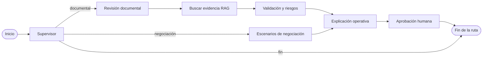

# Visualizador de flujo agéntico

## Propósito

El visualizador permite explicar, auditar y reproducir el recorrido real de LangGraph en un expediente de CrediTrade. No ejecuta agentes, no modifica la nota y no presenta razonamiento privado del modelo.

## Fuente de verdad

La arquitectura se obtiene desde `GRAFO_CREDITRADE.get_graph()` usando LangGraph 1.2.9. Los nombres operativos viven en `credit_notes/graph_catalog.py`; el mismo catálogo determina qué handlers se registran al construir el grafo. Las aristas no están duplicadas en el frontend.



Este Mermaid sólo documenta el diseño. La interfaz interactiva se genera desde el grafo compilado.

## Persistencia e instrumentación

Se reutilizan `EjecucionAgente` y `EventoAgente`. El wrapper `instrument_node` registra inicio, entrada sanitizada, finalización o error, salida, diferencias operativas, duración, transición, fuentes RAG y esperas humanas. La instrumentación se aplica al registrar handlers, no dentro de cada agente. El `thread_id` es el UUID de `EjecucionAgente`.

## Sanitización

`sanitize_graph_state` usa una lista blanca operacional. Excluye claves que contengan `key`, `secret`, `token`, `password`, `authorization`, `cookie`, `database_url`, `prompt`, `raw_response`, `api_key` o `connection`.

Los textos se limitan a 500 caracteres, las listas a 12 elementos y la profundidad a cuatro niveles. No se almacenan prompts, chain-of-thought, credenciales, embeddings, documentos completos ni respuestas crudas.

## Estados visuales

- `pending`: pendiente;
- `running`: en ejecución;
- `completed`: completado;
- `waiting_human`: esperando revisión humana;
- `failed`: error controlado;
- `skipped`: ruta omitida;
- `cancelled`: cancelado por decisión;
- `unavailable`: servicio externo no disponible.

Cada estado tiene texto, borde y patrón; el significado no depende únicamente del color.

## Endpoints

Todos requieren autenticación, operador activo y el feature flag habilitado:

- `GET /api/langgraph/estructura/`: grafo real;
- `GET /api/notas/<nota>/langgraph/ejecuciones/`: últimas 25 ejecuciones de la nota;
- `GET /api/langgraph/ejecuciones/<ejecucion>/`: nodos, eventos, fuentes y diferencias.

No se serializan modelos Django automáticamente. Los metadatos técnicos adicionales para administradores también están sanitizados.

## Interfaz

La pestaña **Flujo agéntico** ofrece modos arquitectura y ejecución, grafo SVG dirigido, teclado, zoom, desplazamiento, ajuste, exportación SVG, detalle por nodo, alternativa textual, línea de tiempo, reproducción y polling cada dos segundos sólo mientras la ejecución está activa.

La reproducción consulta eventos persistidos y nunca ejecuta LangGraph, RAG o Gemini.

## Configuración

Agregar en el entorno correspondiente:

```env
LANGGRAPH_VISUALIZER_ENABLED=True
```

Cuando es `False`, la pestaña no se renderiza, los endpoints responden 404 y el flujo normal sigue funcionando.

## Permisos

El visualizador reutiliza la política de acceso a expedientes de Django. Las consultas parten de una nota o ejecución específica y las listas no mezclan otras notas. Los usuarios anónimos son redirigidos al inicio de sesión y los operadores inactivos no acceden a la arquitectura.

## Rendimiento y serverless

- No usa WebSockets ni SSE.
- La estructura estática se cachea por proceso.
- Usa `select_related` y `prefetch_related`.
- Detiene el polling al salir del estado activo.
- Cada nodo añade normalmente dos escrituras compactas.
- No guarda embeddings ni estados completos sin filtrar.

La sobrecarga esperada es principalmente dos inserciones pequeñas por nodo. La duración real puede revisarse en `duracion_ms` en el entorno de despliegue.

## Prueba manual

1. Aplicar `0006_agent_flow_observability` en PostgreSQL.
2. Definir `LANGGRAPH_VISUALIZER_ENABLED=True`.
3. Reiniciar o redesplegar Django.
4. Abrir un expediente y entrar en **Flujo agéntico**.
5. Revisar el modo arquitectura.
6. Ejecutar un análisis desde **Análisis IA**.
7. Seleccionar la ejecución y comprobar ruta, eventos y checkpoint.
8. Registrar una decisión humana y actualizar.
9. Reproducir los eventos y exportar el SVG.
10. Desactivar la variable y confirmar que la pestaña y endpoints desaparecen.

## Limitación conocida

La ejecución actual es síncrona. El polling puede observarla desde otra pestaña mientras el POST sigue activo, pero la pestaña que inició el análisis navega cuando recibe la respuesta. El visualizador no simula progreso ni sustituye un worker asíncrono.

## Verificación

```powershell
.\venv\Scripts\python.exe manage.py check
.\venv\Scripts\python.exe manage.py test
.\venv\Scripts\python.exe manage.py makemigrations --check --dry-run
```
